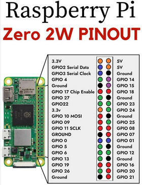

## Uart usb:


### 1. Add setting in `/boot/cmdline.txt` and `/boot/config.txt`

- Modify file /boot/cmdline.txt
```text
dwc_otg.lpm_enable=0 root=/dev/mmcblk0p2 rootfstype=ext4 rootwait console=serial0,115200 console=tty1
```

- Add a config in file /boot/config.txt
```text
enable_uart=1
```

**P/S: if machine running out of RAM to build, this will cause the Out of Memory (OOM) Killer terminate process using the most memory. To resolve this, swap ram need to be allocated more**

```bash
sudo swapon --show                  # this will check swap
df -h                               # check tmpfs
sudo fallocate -l 1G /swapfile      # allocate new more 1G to swapfile

```

### 2. The Connections:

Pinout of Pi Zero 2 W:



- Connect Raspberry Pi's TX (GPIO14) to the USB-to-Serial Adapter's RX (RXD).

- Connect Raspberry Pi's RX (GPIO15) to the USB-to-Serial Adapter's TX (TXD).

- Connect Raspberry Pi's GND to the USB-to-Serial Adapter's GND.

**P/S: Do not connect the VCC pin of the USB-to-Serial(`3.3V/5V`) adapter to the Raspberry Pi (`3.3V`). 
They are both using seperate voltage power.**

