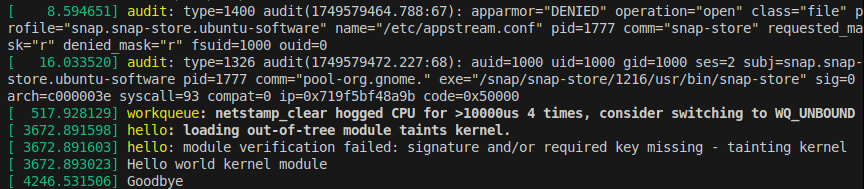

## Build Kernal module by Header:

### 1. Setup environment
Using `uname -r` to detect the current kernal version

Install header with the right version `uname -r`

```bash
sudo apt install –y linux-headers-`uname -r`
```

The path to module: `/lib/modules/`

### 2. compile with header module

Create a Makefile to build a kernal module with  ``/lib/modules/`uname -r`/build``

```makefile
# Hello world kernel module

EXTRA_CFLAGS = -Wall
# Objetc file for module hello
obj-m = hello.o

KDIR = /lib/modules/`uname -r`/build

all:
	make -C $(KDIR) M=`pwd` modules

clean:
	make -C $(KDIR) M=`pwd` clean
```

M=`pwd` is the hello.c path

- Output after build is `<file>.ko`

### 3. Install the kernal module:

Assume a module named `hello` was built in previously

```bash
sudo insmod hello.ko
```

### 4. Remove the kernal module:

Assume a module named `hello` was installed in previously

```bash
sudo rmmod hello
```

### 5. Display new kernel messages in real-time:

```bash
sudo dmesg -w
```


### 6. Show desciption from a built kernal module:

Assume a module named `hello` was built in previously

```bash
modinfo hello.ko
```

EX:


