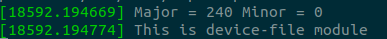
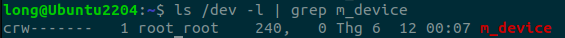
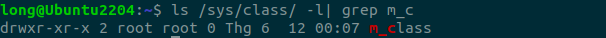

## Code explain:

### 1. Create a device structure which contains all information:

```c
struct m_foo_dev {
    dev_t dev_num;
    struct class *m_class;
} mdev;
```

- `dev_t dev_num`: A kernel data type for device numbers, holds major and minor numbers.

- `struct class *m_class`: Represents the device class used to create entries in `/sys/class` and `/dev`. 

### 2. Constructor Function: `mod_init`

2.1. Allocate Device Number:

```c
if (alloc_chrdev_region(&mdev.dev_num, 0, 1, "m-cdev") < 0) {
    pr_err("Failed to alloc chrdev region\n");
    return -1;
}
```

- Allocates a range of 1 device number starting at minor 0.

- Registers a major number dynamically and stores it in mdev.dev_num.

- `"m-cdev"` is the name shown in `/proc/devices`.

2.2. Create device class:

```c
mdev.m_class = class_create("m_class")
```

- Creates a class named `"m_class"` for udev to associate with this device.

- This class appears under `/sys/class/m_class`.

2.3. Create the Device Node:

```c
device_create(mdev.m_class, NULL, mdev.dev_num, NULL, "m_device")
```

- Creates a device file `/dev/m_device`.

- Links it to the class `m_class` and device number `mdev.dev_num`.

### 3. Destructor Function: `mod_exit`

    when module is unload, remove the initialize object in Contructor function

```c
device_destroy(mdev.m_class, mdev.dev_num);  // Remove /dev/m_device
class_destroy(mdev.m_class);                 // Remove /sys/class/m_class
unregister_chrdev_region(mdev.dev_num, 1);   // Free the major/minor numbers
```

## Output:

1. Message log:



2. Check device existance:



3. Check class existance:

