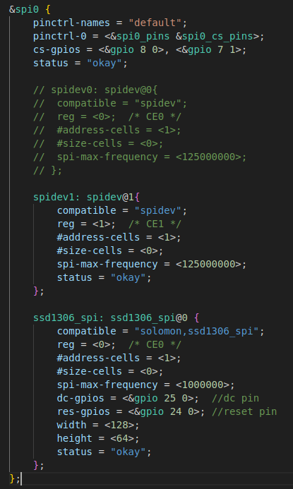

### Device Tree Configuration for SSD1306 SPI

## Brief sumary

- **Device Initialization:**  
  The driver allocates a buffer, requests the DC and Reset GPIOs, and sets up the SPI interface.
- **Display Initialization:**  
  The display is reset and initialized with the required command sequence.
- **Display Update:**  
  The driver writes test patterns to the display buffer and updates the OLED via SPI.
- **Device Tree Integration:**  
  The driver binds to devices with `compatible = "solomon,ssd1306_spi"` in the device tree.

## Device tree node
To enable the SSD1306 OLED display over SPI, add a device tree node similar to file `bcm2710-rpi-zero-2-w.dts`:



## Directory Hierarchy
```
|—— Makefile
|—— device_tree_spi.png
|—— drivers
|    |—— Makefile
|    |—— mspi2
|        |—— Makefile
|        |—— mspi2.c
```


## Key Functions

- `ssd1306_write_cmd` / `ssd1306_write_data`: Send commands/data to the display.
- `ssd1306_init_display`: Reset and initialize the display.
- `ssd1306_update_display`: Write the buffer to the display.
- `ssd1306_probe`: Called when the device is detected; sets up everything.
- `ssd1306_remove`: Turns off the display on driver removal.

## Usage

1. **Configure the device tree** as shown above.
2. **Build the kernel module** in the `drivers/mspi2` directory:
   ```sh
   bitbake virtual/kernel
   ```
3. **Insert the module**:
   ```sh
   sudo insmod mspi2.ko
   ```
4. The display should initialize and show test patterns.

**Note:**  
Adjust GPIO numbers in the device tree to match your hardware wiring.