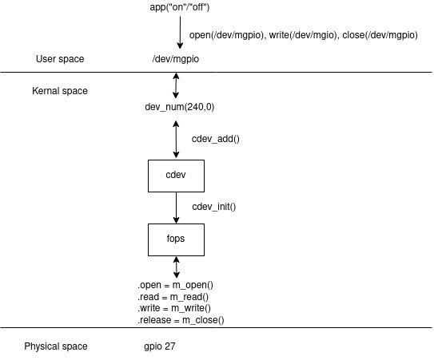

## Description

This section for overview of basic kernal module:

1. Set Up Development Environment

2. Write the first module code (init exit) (`9.0`)

3. Device number, device file and charactor device (`9.1`)

4. File operation (`9.2`)

5. Charactor device and driver kernel (`9.5` `9.6`)

Interaction between a user-space application and a GPIO (General Purpose Input/Output) pin, specifically GPIO 27, through a custom device driver in the Linux kernel:



## Cheat code command line in terminal

1. Check version kernal using currently: `uname -r`

2. Turn on message log in kernal: `sudo dmesg -w`

3. List device file: `ls /dev -l`

4. List kernal module: `lsmod`

5. Check system call when interact a kernal module: `strace <write to deivce>`

## Build Image/Kernel module with yocto project (`meta-openembedded` + `meta-raspberrypi`)


In `~/yocto/poky/build` need to extract code linux-raspberrypi into folder`workspace/sources/linux-raspberrypi`by using devtool cmd

```bash
devtool modify virtual/kernel
```

Note: when build the are 3 option: Build full machine, Build module, Built-in


### a. Build module:

In Makefile with `obj-m` 
```bash
bitbake virtual/kernel
# build with obj-m
```

-> the output is file `.ko` can be add with cmd `insmod <module_name>.ko` in pi machine

### b. Built-in:

In Makefile with `obj-y` 
```bash
bitbake virtual/kernel
# build with obj-y
```
-> the output is zImage

copy zImage built-in yocto to sdcard contain file named `boot`: `/media/long/boot`

the module will be init along with booting the machine

### c. Build full machine:

```bash
bitbake core-image-sato 
#or another core-image-*
```
build full machine with output file `.wic` which also build include with

1. bootloader, config, ...

2. zImage

3. kernel module, driver,...