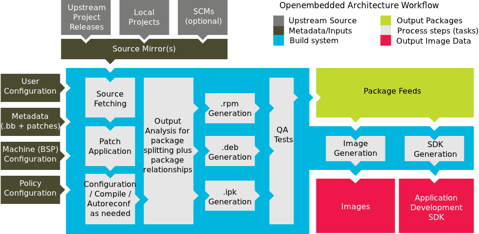

# Yocto-project
This is a note for self study


## Description

The Yocto Project is an open-source system that helps developers create custom operating systems (Linux/Android) for embedded devices. It is a set of tools and processes for building operating systems from scratch, including the kernel, file system, and accompanying applications.

An overview for Yocto Project Development Environment



*The Yocto Project Development Environment*

## Keyword content

1. BitBake uses the operating system, recipes, workflow coding, file system creation, and other operating system components.

2. Recipes are how a package of file descriptors is compiled and installed in the Yocto Project

3. Layers (meta-layers) are how the Yocto Project organizes and manages the components of the operating system. Each layer contains recipes, patches, and configurations related to a specific function or type of hardware.

    * Meta-layer: A layer can contain hardware configurations (e.g. meta-raspberrypi for Raspberry Pi, meta-beaglebone for  BeagleBone), software (e.g. meta-openembedded), or individual layers of the project you create.
    * Layer Priority: Yocto allows for priority ordering of layers, making it easy to override or extend components.

4. Configuration file: 

    * local.conf -> add package
    * bblayers.conf -> configuration layer

5. Metadata & Class: TBD

6. OpenEmbedded: a framework that provides the environment and structure for creating embedded operating systems

7. Package: output of compilation in Yocto (.ipk, .deb, or .rpm)

8. Image: contains all packages which have to be built and installed into the final root file system

9. Recipe: a file contains instructions on how to configure, compile and deploy a given piece of software.

10. Machine: a file used to describe hardware information

11. Distro: Distro with fully customized configuration, software, kernel

12. SDK: a kit Cross-development toolchain used for cross complier with another target machine, contain auto script, enviroment for the yocto development

## File local.conf

### Common config used in yocto

```terminal
IMAGE_INSTALL_append = " libcurl"   -> add a package named libcurl

MACHINE ?= "qemux86-64"             -> config target machine name "qemux86-64"

INHERIT += "rm_work"                -> remove some file after build to save memory space
```

## CMD list

### 1. Setup enviroment

Need to run this cmd before using bibake, devtool, runqemu

```terminal
source oe-init-build-env
```

### 2. Build Image with "bitbake (`target`)"

bibake command is used to build a image.

```terminal
bitbake core-image-minimal
```

List target common:

    1. core-image-minimal
    2. core-image-sato
    3. meta-toolchain
    4. meta-ide-support

### 3. Tool "devtool"

1. build

    Build a recipe

```terminal
devtool build <recipe>
```

2. deploy-target

    Deploy a built recipe to machine/qemu:

```terminal
devtool deploy-target <built recipe> root@<IP>
```

3. finish

    Add a recipe to a layer

Change <*name> to the exact layer

```terminal
devtool finish -f <recipe> ../meta-<*name>/recipes-<*name>/
```

4. modify

    Extract an existance recipe of a machine/qemu into host workspace

```terminal
devtool modify <recipe>
```

5. reset

    Terminate "devtool modify"

```terminal
devtool reset <recipe>
```

6. update-recipe

    Create a patch file for comparing differential commit git of a recipe

```terminal
devtool update-recipe <recipe>
```

## Package and split Package

## Flash an image

1. Check build folder (example of pi zero)

    path_to_yocto/poky/build/tmp/deploy/images/raspberrypi0-wifi/

2. Check list device sdcard, usb

linux command lsblk

```terminal
~$ lsblk
```

3. flash image to sd card

   - Create a copy and extract file:

```terminal
~/yocto/poky$ cp build/tmp/deploy/images/raspberrypi0-wifi/core-image-minimal-raspberrypi0-wifi-20241123012031.rootfs.wic.bz2 temp.wic.bz2
~/yocto/poky$ bzip2 -d temp.wic.bz2
```

   - Flash image

```terminal
~/yocto/poky$ sudo dd if=/dev/zero of=/dev/sdb bs=512 count=1
~/yocto/poky$ sudo dd if=temp.wic of=/dev/sdb bs=4M status=progress
~/yocto/poky$ sync
```